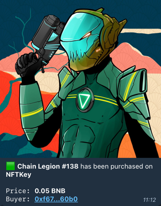

# Spinacho: The Ultimate Telegram NFT Bot

#### Unlock the Power of NFTs with Spinacho. The Cutting-Edge Telegram Bot for Binance Smart Chain NFT Data and Notifications

#### 🌎 Website: [spinacho.org](https://spinacho.org)
#### 📝 Smart contract: [0x210BBC42561d440c20eF1f833F62D17894c29Af0](https://bscscan.com/address/0x210BBC42561d440c20eF1f833F62D17894c29Af0)
#### 🦎 Created by [Lizardev](https://t.me/Lizardev)
#### 🏔 Cousin NFT project: [Chain Legion](https://chainlegion.com)

## 🧠 Motivation

Spinacho is a collection tracking tool designed for Telegram. Its primary objective is to provide an affordable,
on-chain subscription system that delivers relevant collection data to Telegram chats. The tool allows for the addition
of multiple chats, both private and public, per collection, providing users with flexibility and convenience.

## 🚀 Features

Spinacho offers a range of functionalities through a single subscription. Unlike other solutions, Spinacho does not have
tiered pricing or limitations, providing users with access to all features. The bot operates on the principle of
**default chat collections**, allowing each chat to select its preferred collection, which can be changed or removed at
any time. This allows for seamless switching between different collections, providing users with unparalleled
flexibility and convenience.

When creating a subscription, you choose a unique **$TICKER** for your collection. Ticker is used in chats to select
your collection as default or to view tokens from it. Each address can be registered only once, and each ticker is
globally unique. By selecting a collection as default, you unlock access to all features in a chat.

#### 🟩 Real-time mint notifications

Receive real-time notifications for every mint, including relevant token metadata, a transaction link, and the owner of
the minted token (identified by space.id or PancakeSwap username when available)

#### ⬜️ Real-time marketplace notifications

Receive real-time notifications whenever a token from your collection is transacted with on one of the supported
marketplaces. Spinacho offers support for all leading NFT marketplaces on BSC: [NFTKey](https://nftkey.app)
, [OpenSea](https://opensea.io) and [Rareboard](https://rareboard.com). Notification will contain all trade-related data
available in the event and the interacting address (identified by space.id or PancakeSwap username when available).

Here is an overview of supported marketplace events which will notify your chats:

- NFTKey
    - Listing
    - Buy
    - Bid
    - Bid accepted
    - Global bid
    - Global bid accepted
- Rareboard NFTKey
    - Buy
- OpenSea
    - Coming soon

#### 👀 View NFTs

View NFTs from any subscribed collection, regardless of their subscription status. This feature provides a convenient
way to inspect relevant metadata for the selected token, including the name, collection, attribute list, and collection
description.

## 💸 Subscription-based model

Spinacho works on a simple, on-chain subscription-based model, with the **1st month being FREE**.

Subscription can be created or extended on [spinacho.org](https://spinacho.org), or manually, by
calling `createSubscription` or `extendSubscription` on
the [SpinachoSubscription](https://bscscan.com/address/0x210BBC42561d440c20eF1f833F62D17894c29Af0)
contract on BSC. Single subscription fee will cover _one month_ of premium usage, but you can purchase multiple months
in advance.

Spinacho performs daily on-chain checks for subscription updates. Therefore, after extending your subscription,
everything is handled automatically. Spinacho will perform daily checks for subscription validity, and in case of
expiry, will notify you in all groups where your collection is selected as default. You will be notified once every day
during the last 7 days of the subscription with a reminder message. If the subscription is not renewed, on the day of
the expiry, all chats where your collection is selected as default will receive the termination message, and the default
selection will be removed. You can always extend your expired subscription and continue using it regularly.

## 💬 Supported commands

- `/show ${ticker} ${id}`
    - Shows the token with `id == ${id}` from the given collection
- `/show ${id}`
    - Shows the token with `id == ${id}` from the default collection
- `/select ${ticker}`
    - Selects the given collection as default in a chat
- `/reset`
    - Removes the default collection from a chat
- `/current`
    - Shows currently selected collection for a chat
- `/collections`
    - Shows all currently and previously subscribed collections
- `/help`
    - Shows help
